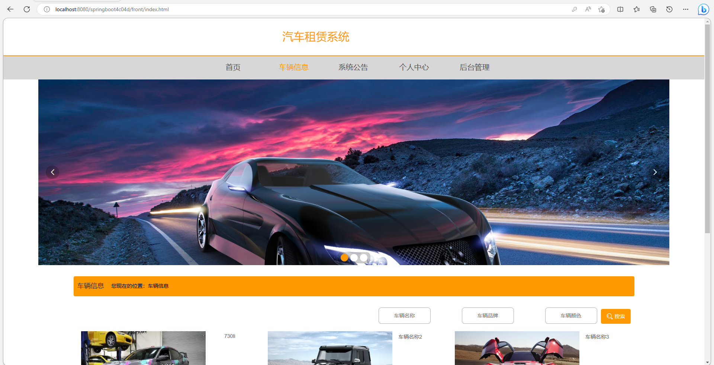
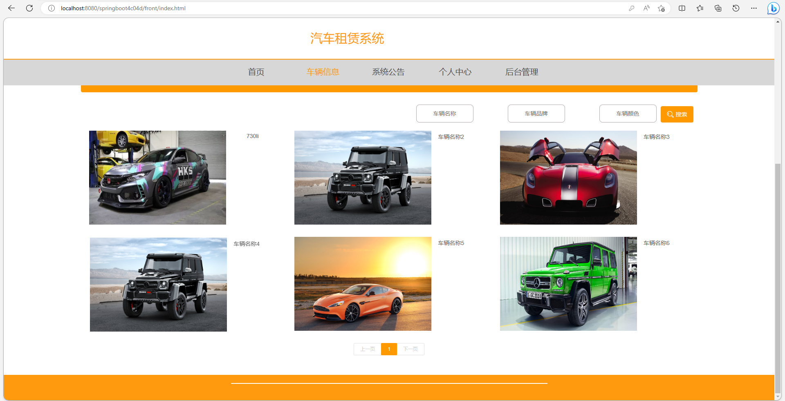
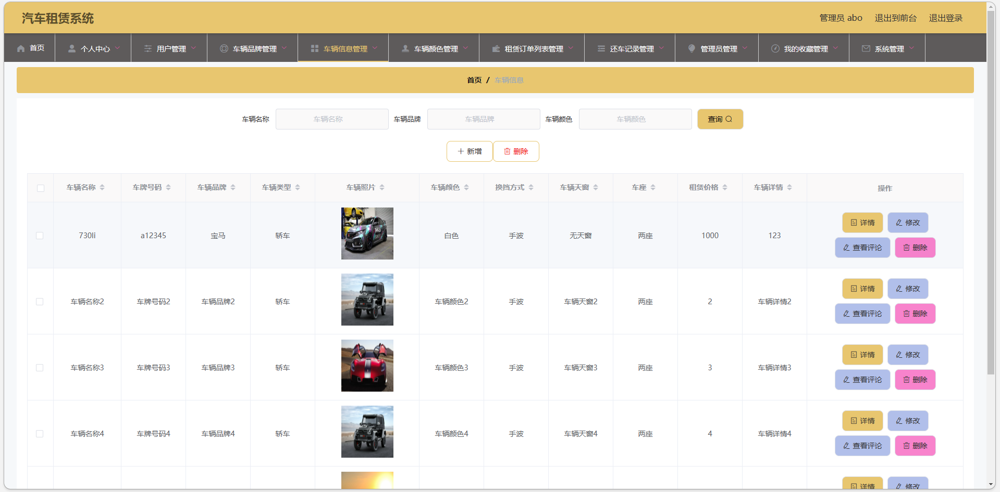
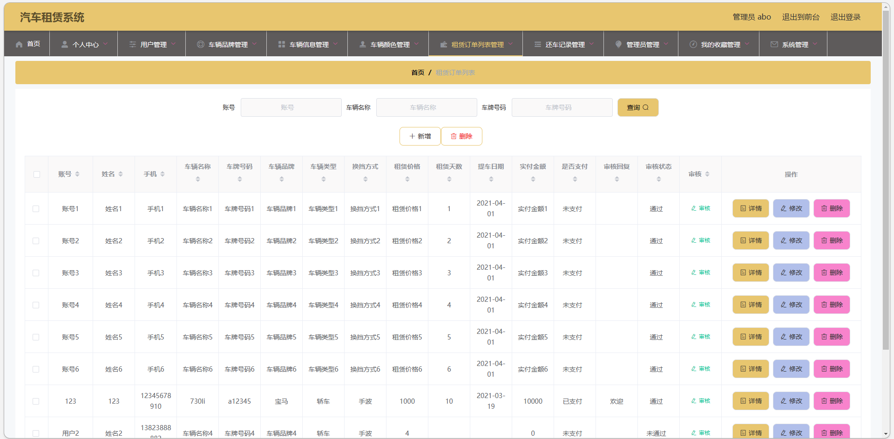
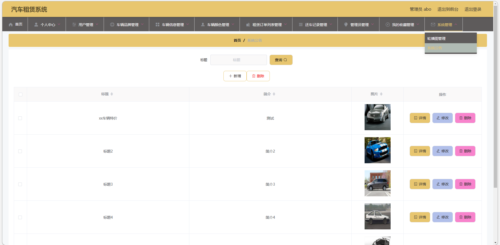

# 汽车租赁系统

## 一、 介绍

基于springboot+vue的汽车租赁系统

运行环境:idea或eclipse 数据库:mysql

开发语言：java

管理员和用户两个角色

首页、车辆信息、系统公告、个人中心、用户管理、车辆品牌管理、车辆信息管理、租赁订单列表管理、还车记录管理、我的收藏管理等

## 二、 系统部分功能界面展示

## 三、 9.9￥ 获取完整源码+sql，需要加Q：3808981644 备用Q：3577148218
## 有问题，或者需要协助调试运行项目的也可联系
